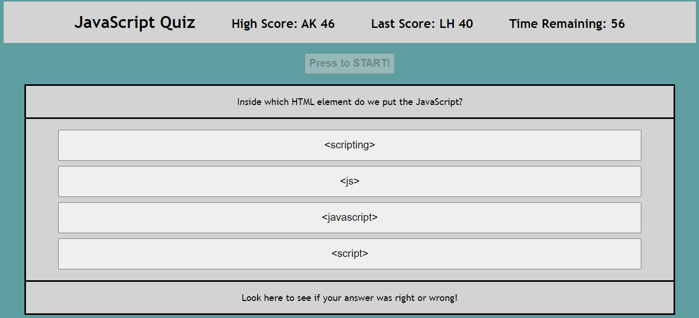

# mod4challenge
A timed quiz on JavaScript fundamentals that stores the high score.

## Description: 
This project is a short JavaScript quiz, that when the user presses the start button, loads the quiz and sets a timer of 60 seconds. The user then answers the questions one at a time. If the user gets a question incorrect, then two seconds are deducted from the users time. When the quiz is over, whether beacuse they have answered all of the questions or because time ran out, they are alerted that the quiz is over and they are given the option to type in their initials with their score. If they have the high scre, then their score will be displayed in the high score section. Otherwise, their score will be displayed as the "last score."

## Screenshot of Webpage

## About the Project:
The quiz runs entirely on JavaScript. An event listener starts the quiz and a countdown timer when the start button is clicked. The countdown timer uses the setInterval() function to countdown from 60, and will end the quiz if the timer reaches 0 or if there are no more questions. The setNewQuestion() function loads the next question and answers from the questions array at the top of the script. When a user clicks on one of the answer choices, it checks to see if the textContent of that button matches the answer for the current question in the questions array. If it does, it displays "RIGHT" at the bottom of the question container and runs the setNewQuestion() function again. If the textContent is NOT the same as the answer from the question array, then it displays "WRONG", deducts two seconds from the time, and then loads a new question. When the quiz is over, the user's score is the time left. If their score is higher than the high score, it is stored to localStorage to be displayed at the top of the page, along side their initials that they type in using a window.prompt. If they don't get the highscore, they still are able to type in their initials and see them displayed with their score at the top in the "Last Score" section.

## Link to Deployed Application
https://adamkeyser45.github.io/mod4challenge/